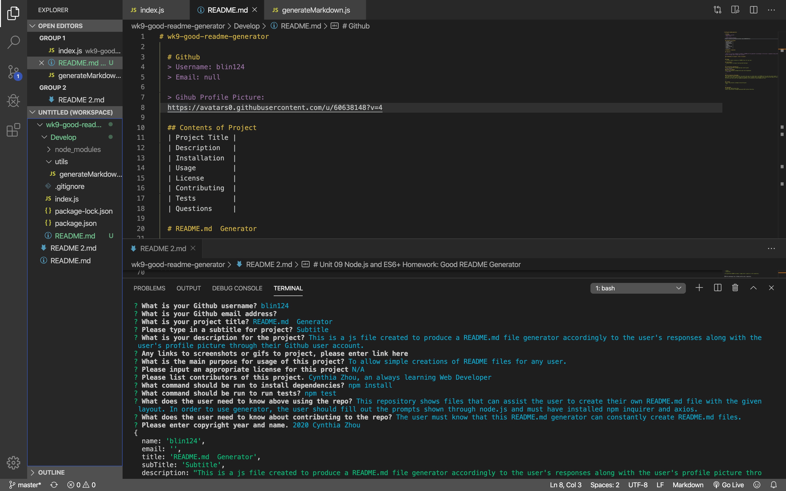

# wk9-good-readme-generator

  # Github
  > Username: blin124
  
  > Gihub Profile Picture:
  https://avatars0.githubusercontent.com/u/60638148?v=4

  ## Contents of Project
  | Project Title |
  | Description   |
  | Installation  |
  | Usage         |
  | License       |
  | Contributing  |
  | Tests         |
  | Questions     |

  # README.md Generator

  ## Subtitle 

  > This is a JS file created to produce a README.md file generator accordingly to the user's responses along with the user's profile picture through their Github user account.

  ## Screenshots of project / Gifs of project:
  

  ## Usage
  - To allow simple creations of README files for any user.

  ## Contributors
  - Cynthia Zhou, an always learning Web Developer

  ---

  ## Installation dependencies
  https://img.shields.io/badge/npm-npm install-green
  > $ npm install
  ### Test run command
  https://img.shields.io/badge/tests-npm test-brightgreen
  > $ npm test

  ---

  ### User Necessary Knowledge
  This repository shows files that can assist the user to create their own README.md file with the given layout. In order to use generator, the user should fill out the prompts shown through node.js and must have installed npm inquirer and axios.
  The user must know that this README.md generator will overwrite any previous files with the name README.md file created.

  ---

  ## License
  https://img.shields.io/badge/license-N/A-gold
  - N/A

  ---

  ## Copyright
  @ Copyright 2020 Cynthia Zhou
  https://img.shields.io/badge/copyright-2020 Cynthia Zhou-blue

  